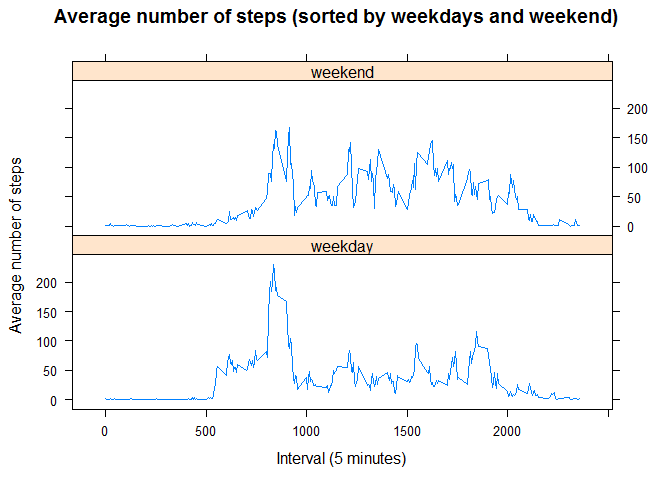

Reproducible Research - Activity Analysis
================
Mirjam Hachem
8 juni 2017

Coursera Data Science Specialization
------------------------------------

### Module 5: Reproducible Research

### Course Project 1

0. Loading and preprossecing the data
-------------------------------------

### Reading the data into R

``` r
activityData <- read.csv("activity.csv")
```

### Transforming the dates in the date column into date format

``` r
activityData$date <- as.Date(activityData$date, format = "%Y-%m-%d")
```

Question 1: What is mean total number of steps taken per day?
-------------------------------------------------------------

### 1.1 Calculate the total number of steps taken per day

``` r
stepsTotal <- aggregate(steps ~ date, activityData, sum, na.rm = TRUE)
```

### 1.2 Make a histogram of the total number of steps taken each day

``` r
hist(stepsTotal$steps, 
     breaks = 10, 
     col = "blue", 
     main = "Total number of steps taken per day", 
     xlab = "Total number of steps taken per day")
```


### 1.3 Calculate and report the mean and median of the total number of steps taken per day

``` r
mean(stepsTotal$steps)
```

    ## [1] 10766.19

``` r
median(stepsTotal$steps)
```

    ## [1] 10765

Question 2: What is the average daily pattern?
----------------------------------------------

### 2.1 Make a time series plot (i.e. type = "l") of the 5-minute interval (x-axis) and the average number of steps taken, averaged across all days (y-axis)

``` r
stepsAverage <- aggregate(steps ~ interval, activityData, mean, na.rm = TRUE)

plot(steps ~ interval, stepsAverage, 
     type = "l", 
     main = "Average number of steps taken per interval", 
     col = "blue", 
     xlab = "Interval (5 minutes)", 
     ylab = "Average number of steps")
```


### 2.2 Which 5-minute interval, on average across all the days in the dataset, contains the maximum number of steps?

``` r
stepsAverage$interval[which.max(stepsAverage$steps)]
```

    ## [1] 835

Question 3: Imputing missing values
-----------------------------------

### 3.1 Calculate and report the total number of missing values in the dataset (i.e. the total number of rows with NAs)

``` r
sum(is.na(activityData$steps))
```

    ## [1] 2304

### 3.2 Devise a strategy for filling in all of the missing values in the dataset.

I will use the mean of the respective 5-minute interval to fill in the missing values. I will execute this with a for-loop that loops through all the rows of the interval variable in the stepsAverage dataset created earlier. First I will store the original dataset activityData into a new dataset activityDataImputed so that the original dataset will remain unchanged.

The loop will compare each row of the interval variable in the \# in stepsAverage and activityDataImputed to each other. When the interval in stepsAverage matches the interval in activityDataImputed the loop will check for a missing value in the steps variable of that row. If it contains a missing value, the loop will replace the NA with the mean for this interval.

### 3.3 Create a new dataset that is equal to the original dataset but with the missing data filled in.

``` r
activityDataImputed <- activityData

for (i in stepsAverage$interval) {
    activityDataImputed[activityDataImputed$interval == i & is.na(activityDataImputed$steps), ]$steps <- stepsAverage$steps[stepsAverage$interval == i]
}
```

Proof that the loop worked: If there are no missing values left in activityDataImputed, then the sum of all missing values should be 0.

``` r
sum(is.na(activityDataImputed))
```

    ## [1] 0

### 3.4 Make a histogram of the total number of steps taken each day and Calculate and report the mean and median total number of steps taken per day. Do these values differ from the estimates from the first part of the assignment? What is the impact of imputing missing data on the estimates of the total daily number of steps?

Creating the histogram:

``` r
stepsTotalImputed <- aggregate(steps ~ date, activityDataImputed, sum)

hist(stepsTotalImputed$steps, 
     breaks = 10, col = "green", 
     main = "Total number of steps taken per day (missing values imputed)",
     xlab = "Total number of steps")
```


Calculating the mean:

``` r
mean(stepsTotalImputed$steps)
```

    ## [1] 10766.19

Calculating the median:

``` r
median(stepsTotalImputed$steps)
```

    ## [1] 10766.19

The mean value is the same value as earlier. The median value is slightly higher and now equal to the mean.

Question 4: Are there differences in activity patterns between weekdays and weekends?
-------------------------------------------------------------------------------------

### 4.1 Create a new factor variable in the dataset with two levels - "weekday" and "weekend" indicating whether a given date is a weekday or weekend day.

Setting the system language of my computer to English in R:

``` r
Sys.setlocale("LC_TIME", "English")
```

    ## [1] "English_United States.1252"

Inserting the weekdays

``` r
activityDataImputed$weekdays <- weekdays(as.Date(activityDataImputed$date))
activityDataImputed$weekdays <- ifelse(activityDataImputed$weekdays %in% 
                                         c("Saturday", "Sunday"), "weekend", "weekday")
```

### 4.2 Make a panel plot containing a time series plot (i.e. type = "l") of the 5-minute interval (x-axis) and the average number of steps taken, averaged across all weekday days or weekend days (y-axis).

``` r
stepsAverageImputed <- aggregate(steps ~ interval + weekdays, activityDataImputed, mean)

library(lattice)

xyplot(steps ~ interval | weekdays, stepsAverageImputed, 
       type = "l", 
       layout = c(1,2), 
       main = "Average number of steps (sorted by weekdays and weekend)", 
       xlab = "Interval (5 minutes)", 
       ylab = "Average number of steps")
```



### Thank you for grading my assignement!
